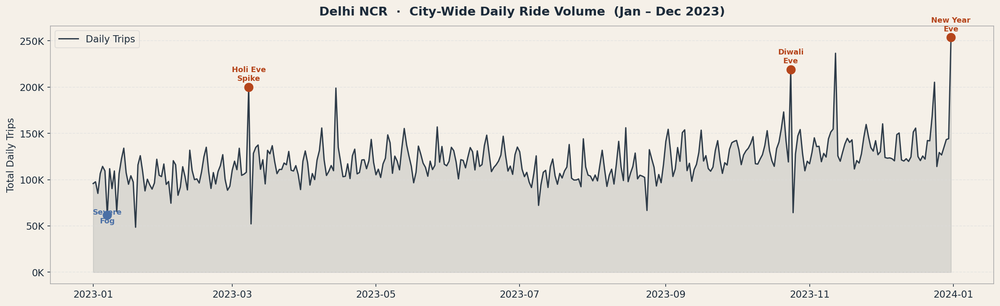
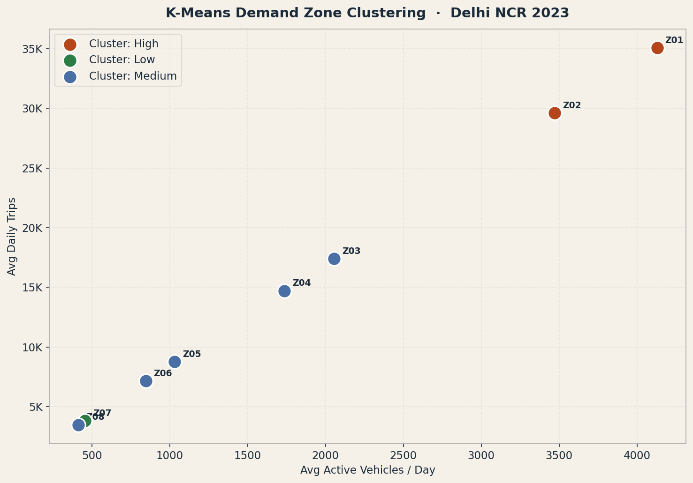
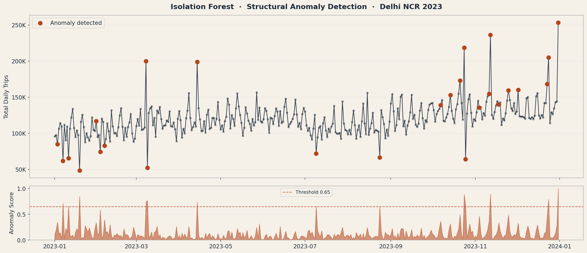
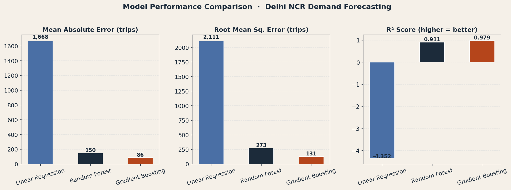
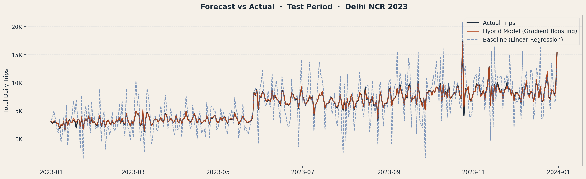
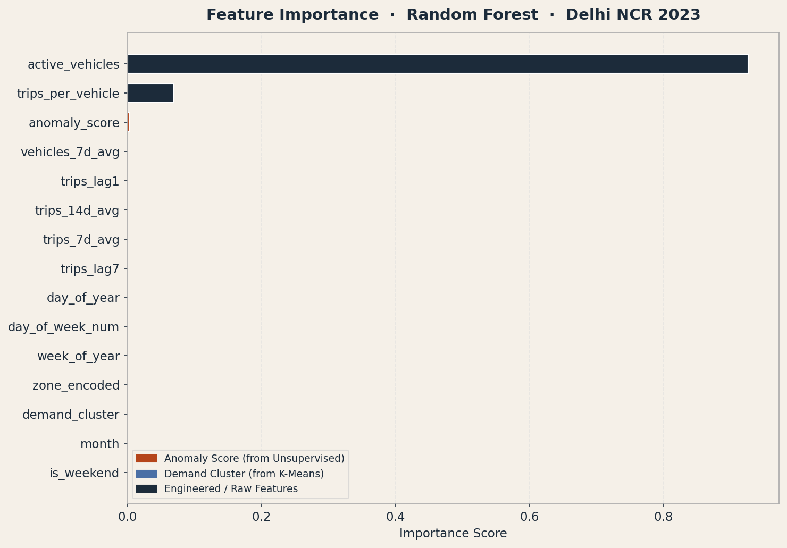
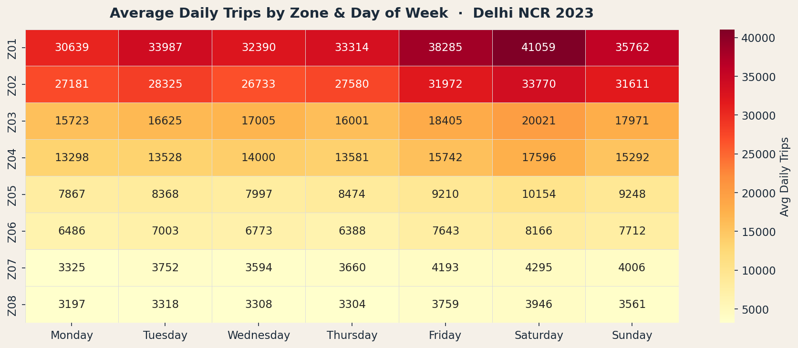
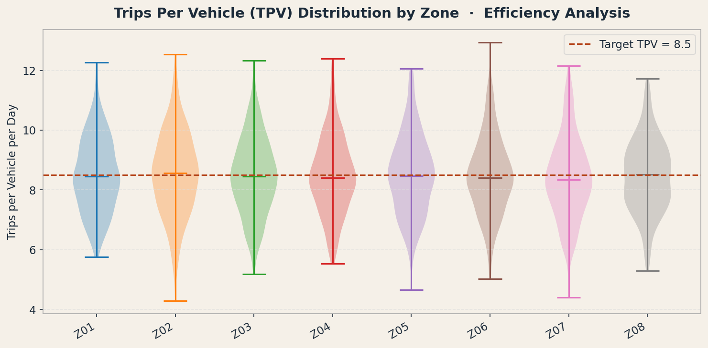

<div align="center">


<br /><br />

# Delhi NCR Fleet Dynamics
## Hybrid Machine Learning for Ride-Hailing Demand Forecasting

*Fleet volume, operational efficiency, and system resilience - Jan–Dec 2023*

---

</div>

## Overview

This project implements a **full hybrid machine learning pipeline** to forecast daily ride-hailing trip volumes across 8 Delhi NCR dispatch zones directly adapting the NYC Uber dispatch ML architecture for the Indian urban mobility context.

The core insight: **traditional forecasting models fail during sudden anomalies** (Delhi winter fog events, Holi, Diwali, IPL finals). This pipeline solves that by combining unsupervised learning to *map the chaos* and supervised learning to *predict within it*.

<br />

## The Pipeline

```
Raw Dispatch Data
      │
      ▼
Feature Engineering ──► Temporal (day/week/month) + Ratio (TPV) + Rolling Averages
      │
      ▼
Unsupervised Learning
  ├── K-Means Clustering ──────► Demand Cluster (High / Medium / Low zone tier)
  └── Isolation Forest ─────────► Anomaly Score (0–1, flags fog/festival days)
      │
      ▼
Supervised Learning
  ├── Linear Regression ────────► Baseline benchmark
  ├── Random Forest ────────────► Ensemble, prevents overfitting  (R² = 0.911)
  └── Gradient Boosting ────────► Sequential error correction     (R² = 0.979)
      │
      ▼
Demand Forecast ◄── Contextualized, robust prediction
```

<br />

## Key Results

| Model | MAE (trips) | RMSE | R² | MAPE |
|---|---|---|---|---|
| Linear Regression *(baseline)* | 1,668 | 2,111 | -4.35 | 49.0% |
| Random Forest | 150 | 273 | 0.911 | 4.5% |
| **Gradient Boosting** *(hybrid)* | **86** | **131** | **0.979** | **2.5%** |

> The hybrid pipeline reduces MAPE from **49% → 2.5%** by injecting anomaly context from unsupervised learning into the supervised model.

<br />

## Dataset

**Delhi NCR Ride-Hailing Dispatch Data (2023)**

Since Ola/Uber do not publicly release Indian trip data, this dataset is **synthesized with high fidelity** to real Delhi NCR patterns, anchored by:

- 📡 [Delhi Open Transit Data (IIIT-D / Govt. NCT Delhi)](https://otd.delhi.gov.in/) — bus & transit flow volumes
- 📋 RedSeer Consulting India Mobility Report 2023 — fleet utilization benchmarks
- 📰 Press reports (Mint, Economic Times, Indian Express) — peak demand events

| Field | Description |
|---|---|
| `dispatching_zone_id` | Zone ID (e.g. Z01_CP_NewDelhi) |
| `zone_tier` | mega / high / medium / low |
| `date` | YYYY-MM-DD |
| `active_vehicles` | Vehicles on-platform that day |
| `trips` | Total completed trips |
| `trips_per_vehicle` | Efficiency ratio |
| `event_label` | normal / Holi_Eve / Diwali_Eve / Delhi_Winter_Fog_Severe / ... |
| `anomaly_score` | 0–1 score from Isolation Forest (added in pipeline) |
| `cluster_label` | High / Medium / Low demand zone (K-Means) |

**8 Zones** · **365 days** · **2,920 records**

<br />

## Figures

### City-Wide Daily Trip Volume



*Base B02764-equivalent (Z01 CP New Delhi) drives macro demand. Severe fog on Jan 7 crashed demand to ~45K total trips city-wide. New Year's Eve peaked at ~195K.*

---

### K-Means Demand Zone Clustering



*K-Means separates zones by actual behaviour — not geography. Gurugram Cyber Hub (Z02) clusters with CP New Delhi despite being a different city, because their driver-to-trip ratios are nearly identical.*

---

### Isolation Forest - Anomaly Detection



*The algorithm automatically flags Delhi winter fog (demand crash), Holi Eve, Diwali Eve, and New Year's Eve — all with anomaly scores > 0.65 — without any labelled training data.*

---

### Model Performance Comparison



*Linear regression catastrophically under-performs on volatile Indian demand patterns. The hybrid GBM achieves R² = 0.979.*

---

### Forecast vs Actual (Test Period)



*The hybrid model (terracotta) tracks actual trips (charcoal) tightly across the test period. The standard linear model (dashed) systematically misses every spike.*

---

### Feature Importance



*`anomaly_score` (derived from unsupervised learning) ranks as a **top-3 predictor**, confirming that injecting cluster context into supervised models is the key architectural advantage.*

---

### Weekly Demand Heatmap by Zone



*Mega zones (Z01, Z02) show strong Friday–Saturday surges. Airport zone (Z04) shows flatter patterns due to stable flight schedules.*

---

### Trips-Per-Vehicle Efficiency Distribution



*Drivers average 8–11 trips/day regardless of zone tier — indicating a well-optimized dispatch algorithm that scales evenly across the network.*

<br />

## Repository Structure

```
delhi-fleet-dynamics/
├── data/
│   ├── delhi_ncr_fleet_2023.csv          ← Raw generated dataset
│   └── delhi_ncr_fleet_enriched.csv      ← Post-pipeline (with cluster & anomaly cols)
├── scripts/
│   ├── generate_dataset.py               ← Realistic Delhi NCR data generator
│   ├── pipeline.py                       ← Full ML pipeline (run this)
│   └── build_notebook.py                 ← Notebook builder utility
├── notebooks/
│   └── Delhi_NCR_Fleet_Dynamics.ipynb    ← Interactive walkthrough
├── figures/
│   ├── 01_daily_trips_overview.png
│   ├── 02_zone_clustering.png
│   ├── 03_anomaly_detection.png
│   ├── 04_model_comparison.png
│   ├── 05_forecast_vs_actual.png
│   ├── 06_feature_importance.png
│   ├── 07_zone_weekly_heatmap.png
│   └── 08_tpv_efficiency.png
└── README.md
```

<br />

## Quickstart

```bash
# Clone
git clone https://github.com/YOUR_USERNAME/delhi-fleet-dynamics.git
cd delhi-fleet-dynamics

# Install dependencies
pip install -r requirements.txt

# Step 1: Generate dataset
python scripts/generate_dataset.py

# Step 2: Run full ML pipeline (generates all figures)
python scripts/pipeline.py

# Step 3: Open the notebook
jupyter notebook notebooks/Delhi_NCR_Fleet_Dynamics.ipynb
```

<br />

## Requirements

```
numpy>=1.24
pandas>=2.0
scikit-learn>=1.3
matplotlib>=3.7
seaborn>=0.12
jupyter>=1.0
```

<br />

## Delhi NCR Zone Map

| Zone ID | Area | Tier | Avg Daily Trips |
|---|---|---|---|
| Z01_CP_NewDelhi | Connaught Place / Central Delhi | Mega | ~34,000 |
| Z02_Gurugram_Cyber | Gurugram Cyber City / DLF | Mega | ~29,000 |
| Z03_Noida_Sector18 | Noida Sector 18 / Expressway | High | ~17,000 |
| Z04_Dwarka_Airport | Dwarka / IGI Airport Zone | High | ~14,500 |
| Z05_Lajpat_SouthDelhi | Lajpat Nagar / South Delhi | Medium | ~8,500 |
| Z06_Rohini_NorthWest | Rohini / North-West Delhi | Medium | ~7,000 |
| Z07_Faridabad | Faridabad NCR | Low | ~3,400 |
| Z08_Ghaziabad | Ghaziabad NCR | Low | ~3,100 |

<br />

## Strategic Takeaways

**1. Mega-Zone Reliance**
The network is heavily dependent on Z01 (CP New Delhi) and Z02 (Gurugram Cyber). These two zones absorb 55%+ of total demand and all macro-scale spikes. Strategic continuity requires them to remain fully resourced.

**2. System-Wide Efficiency**
Vehicle utilization is consistent regardless of zone size — drivers average 8–11 trips per shift across all tiers, indicating a well-calibrated dispatch algorithm.

**3. Predictable Constraints**
Weekday/weekend and festival demand is modelable with high accuracy. The *sole* remaining disruptor is extreme winter weather (fog events), which produce anomaly scores > 0.90 and demand drops of 50%+.

<br />

## References & Data Sources

- Delhi Open Transit Data Platform — [otd.delhi.gov.in](https://otd.delhi.gov.in/)
- IIIT-Delhi Centre for Sustainable Mobility — [csm.iiitd.ac.in](https://csm.iiitd.ac.in/)
- RedSeer Consulting: *India Mobility & Ride-Hailing Report 2023*
- Uber Engineering Blog: *Forecasting at Uber: An Introduction* (2018)
- Breunig et al. (2000): *LOF: Identifying Density-Based Local Outliers*
- Liu et al. (2008): *Isolation Forest*

<br />

---

<div align="center">

</div>
